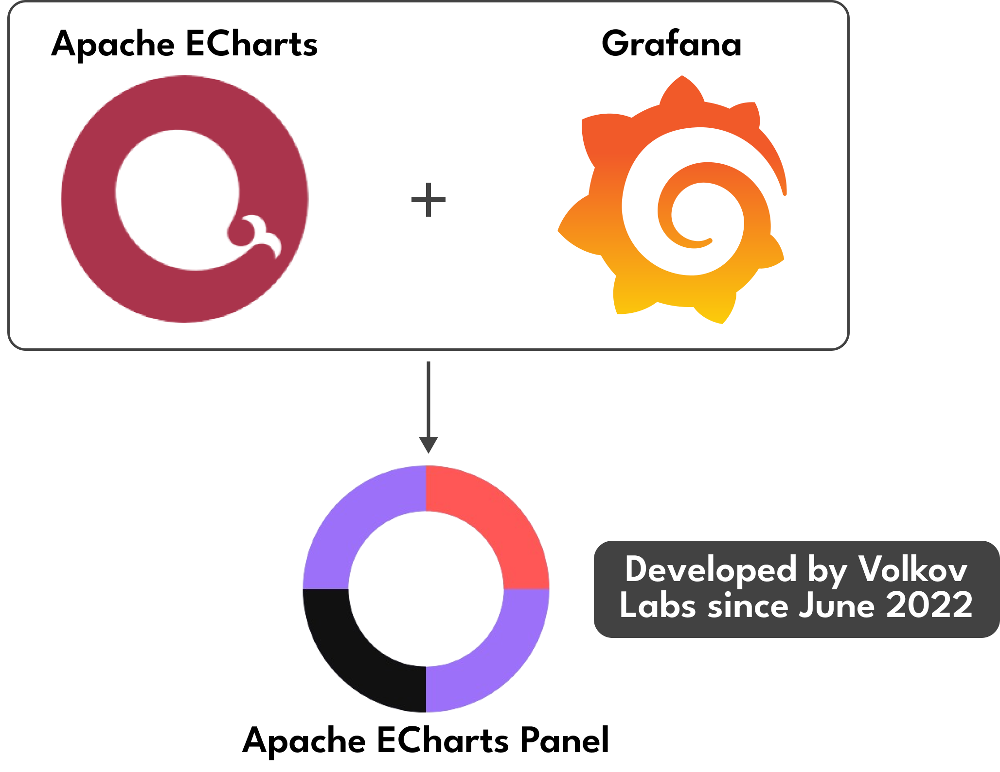
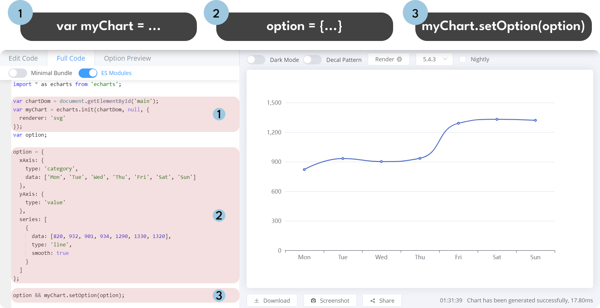
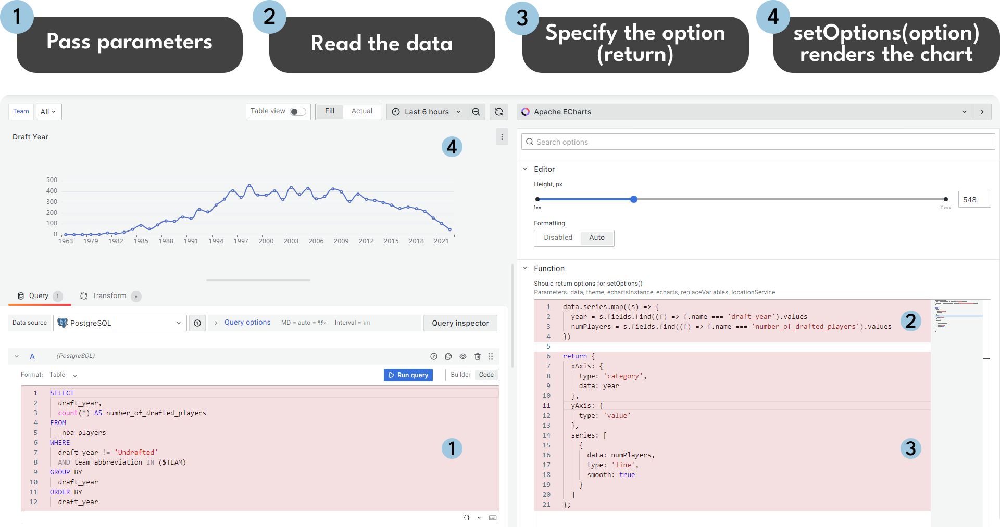
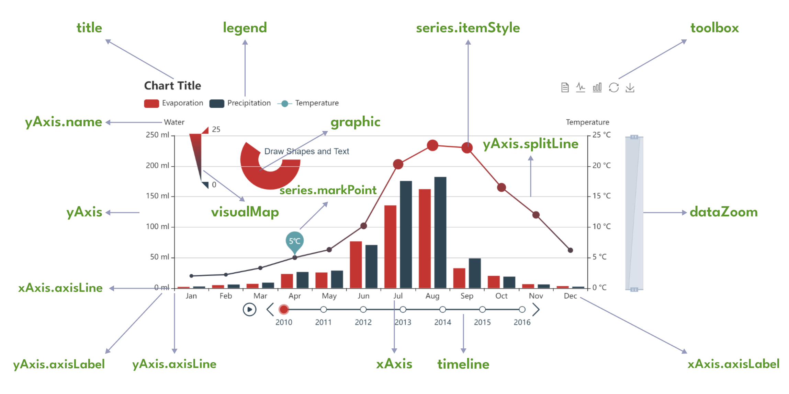

# Apache ECharts Plugin for Grafana

The Apache ECharts Panel plugin serves as a data visualization extension for Grafana, enabling the seamless integration of charts and graphs from the widely used Apache ECharts library into your Grafana dashboard.

Apache ECharts is a robust and versatile data visualization library, offering an extensive range of chart types, including statistical capabilities. Developed in pure JavaScript and built on zrender, a lightweight graphic library for chart rendering, Apache ECharts provides a powerful solution for creating interactive and highly customizable charts.



## ECharts Function

The Apache ECharts library has a primary function called `setOption(option)`. This function is called by the Apache ECharts panel (the ECharts Function) with only one required parameter "option". This parameter describes the chart in the JSON format.
The Apache ECharts panel can be configured by writing the ECharts Function. This function generally consists of two parts:

- JavaScript to read data points from the data source.
- JSON to specify a graph as options.

The Monaco Editor is used in the Apache ECharts plugin for Grafana. It is a fully featured code editor from VS Code, best known for being the text editor that powers VS Code. However, it’s a bit more nuanced.

Here are the steps to configure the Apache ECharts panel:

1. The process starts with the Grafana dashboard where parameters like data, theme, and echarts are set.
2. These parameters are then used in a function within the Monaco Code editor in the Apache ECharts visualization panel to edit and configure the ECharts. This function is referred to as the ECharts function.
3. After editing, this function is executed by calling `.setOption()` method with options as its parameter in the Apache ECharts library.
   Please refer to the schema and the print screen below for illustration.



The return clause is where you need to specify the options parameter to be passed into the `setOption(option)` Apache ECharts function.



### Parameters

| Parameter        | Description                                                               |
| ---------------- | ------------------------------------------------------------------------- |
| data             | Object containing a time range, series, and request information.          |
| echarts          | ECharts library.                                                          |
| echartsInstance  | Instance of the ECharts library. See the example in the screenshot above. |
| ecStat           | A statistical and data mining tool for Apache ECharts.                    |
| eventBus         | Publish and subscribe to application events.                              |
| locationService  | Works with browser location and history.                                  |
| notifyError      | Display error notifications.                                              |
| notifySuccess    | Display success notifications.                                            |
| replaceVariables | Function to interpolate variables.                                        |
| theme            | Theme object.                                                             |

To inspect these parameters, use the browser's developer console:

```javascript
console.error(
  data,
  theme,
  echartsInstance,
  echarts,
  replaceVariables,
  locationService
);
```

### Notifications

You can display success and error notifications when handling specific events:

```javascript
notifySuccess(["Update", "Values updated successfully."]);
notifyError(["Update", `An error occurred while updating values.`]);
```

### Components

Here are some of the most frequently used components of Apache ECharts and their brief explanations:

- **Series**: A series is a collection of data that is represented on the chart. It can be a line, bar, scatter, pie, or other types of charts.
- **Legend**: The legend is a component that displays the meaning of the colors or symbols used in the chart.
- **Tooltip**: The tooltip is a component that displays additional information about the data point when the user hovers over it.
- **Grid**: The grid is a component that defines the layout of the chart, including the number of rows and columns.
- **Axis**: The axis is a component that defines the scale and labels of the chart.
- **Title**: The title is a component that displays the title of the chart.
- **Toolbox**: The toolbox is a component that provides various tools for the user to interact with the chart, such as data zooming, data view, and more.



More information about the components and their usage can be found in the official [Apache ECharts documentation](https://echarts.apache.org/en/cheat-sheet.html).

## Data Sources

Both the Apache ECharts Panel and Grafana support various data sources for querying data to build charts. The code snippet below demonstrates how to retrieve data from your data source for use in the Apache ECharts Panel:

```javascript
// Utilizing the .map() and .find() functions in JavaScript.
// The refId query extracts data from a data source where default
// names are assigned as A, B, and so on.

data.series.map((s) => {
  if (s.refId === "logo") {
    images =
      s.fields.find((f) => f.name === "body").values.buffer ||
      s.fields.find((f) => f.name === "body").values;
  } else if (s.refId === "connections") {
    sources =
      s.fields.find((f) => f.name === "source").values.buffer ||
      s.fields.find((f) => f.name === "source").values;
    targets =
      s.fields.find((f) => f.name === "target").values.buffer ||
      s.fields.find((f) => f.name === "target").values;
  } else if (s.refId === "nodes") {
    titles =
      s.fields.find((f) => f.name === "title").values.buffer ||
      s.fields.find((f) => f.name === "title").values;
    descriptions =
      s.fields.find((f) => f.name === "description").values.buffer ||
      s.fields.find((f) => f.name === "description").values;
  }
});

// The provided code handles three queries: logo, connections, and nodes.
// For compatibility with Grafana 10 and its older versions, ensure
// the use of 'values' and 'values.buffer' fields.
```

## Array of Arrays

One-dimensional arrays can be converted into multi-dimensional arrays if needed. Values for each field are fetched in the example below and combined into an array of arrays:

```javascript
const series = data.series.map((s) => {
  // Handling different queries (Rate, Calls, Name).
  // ...
  return rates.map((d, i) => [d, calls[i], names[i]]);
})[0];
```

## Pie Chart

```javascript
const pieData = data.series.map((s) => {
  // Handling different queries (Model, Value).
  // ...
  return values.map((d, i) => {
    return { name: models[i], value: d };
  });
})[0];
```

## Wind Speed

```javascript
let wind;
data.series.map((s) => {
  // Handling different queries (Time, Speed, Direction).
  // ...
  wind = time.map((id, index) => {
    return { symbolRotate: rotate[index], value: [time[index], value[index]] };
  });
});
```

## Circular Graph

```javascript
let nodes, links;
data.series.map((s) => {
  if (s.refId === "nodes") {
    // Handling different queries (sIp, bytes, Count).
    // ...
    nodes = titles.map((title, i) => ({
      name: title,
      symbolSize: symbolSizes[i],
      value: symbolSizes[i],
      category: categories[i],
      label: {
        show: symbolSizes[i] > 1,
      },
    }));
  }
  if (s.refId === "links") {
    // Handling different queries (sIp, dIp).
    // ...
    links = sources.map((source, i) => ({
      source: source,
      target: targets[i],
    }));
  }
});
```

## Sort by

```javascript
let names = [];
let amounts = [];
data.series.map((s) => {
  // Handling sorting by Name and Amount.
  // ...
});

const namesOrdered = namesOrder.map((i) => names[i]);
const amountsOrdered = amountsOrder.map((i) => amounts[i]);
```

## Event Handling

You can handle specific events while viewing charts, such as mouse events, with the `echartsInstance` instance. For more examples and detailed descriptions, refer to the [Apache ECharts documentation about Events and Actions](https://apache.github.io/echarts-handbook/en/concepts/event/).

### Mouse Click

To prevent multiple event handling, disable all previous event handlers:

```javascript
// On Mouse Click
echartsInstance.off("click");
echartsInstance.on("click", (params) => {
  window.open(
    "https://www.google.com/search?q=" + encodeURIComponent(params.name)
  );
});

// On Double Click
echartsInstance.off("dblclick");
echartsInstance.on("dblclick", () => {
  echartsInstance.resize();
});
```

## ECharts Instance

Visit [this link](https://volkovlabs.io/plugins/volkovlabs-echarts-panel/instance/) for detailed information about the `echartsInstance`. It is a created instance (container) of the Apache ECharts library, allowing you to:

- Get the width and height of the ECharts container.
- Access the DOM (Document Object Model) to include additional elements.
- Resize the chart size.
- Handle events.
- Update options, etc.

To scale the content for fitting the resized panel, use instance methods to retrieve the width and height of the panel:

```javascript
graphic: {
  type: "image",
  style: {
    image: `data:image/svg+xml;utf8,${SVG}`,
    width: echartsInstance.getWidth(),
    height: echartsInstance.getHeight(),
  },
},
```

### Create DOM elements

Incorporating DOM elements, such as buttons, checkboxes, and dropdown boxes, to the panel in Grafana with Apache ECharts can be achieved by utilizing the `echartsInstance`.

Example: Button Integration with an Event Handler

```javascript
// Defining a function to be triggered on button click
const myFunction = () => {
  alert("myFunction() called!");
};

// Retrieving the DOM for the Apache ECharts panel
let dom = echartsInstance.getDom();

// Retrieving the child nodes of the panel
let nodeList = dom.childNodes;

// Checking if controls haven't been added to the DOM yet
if (nodeList.length < 2) {
  // Creating a new button element
  const btn = document.createElement("button");

  // Setting the button label
  const textNode = document.createTextNode("My Button");
  btn.appendChild(textNode);

  // Adding a click event handler to the button
  btn.addEventListener("click", myFunction);

  // Creating a new <div> element
  const div = document.createElement("div");

  // Adding the button to the <div>
  div.appendChild(btn);

  // Inserting the new <div> ahead of the existing chart <div>
  dom.insertBefore(div, dom.firstChild);
}
```

## Variables

Use the `replaceVariables()` function to replace dashboard and global variables:

```javascript
const email = replaceVariables("${__user.email}");
```

Update dashboard variables with event handlers, where:

- `name` is the name of the variable. Add "var-" to update the variable value in the URL.
- `value` is the updated value.

```javascript
echartsInstance.on("click", (params) => {
  locationService.partial({ "var-name": value }, true);
});
```

## References

- [Apache ECharts Cheat Sheet](https://echarts.apache.org/en/cheat-sheet.html)
- [Apache ECharts Tutorial - Events and Actions](https://echarts.apache.org/en/tutorial.html#Events%20and%20Actions%20in%20ECharts)
- [Apache ECharts Getting Started](https://echarts.apache.org/handbook/en/get-started)
- [Volkov Labs Plugins](https://volkovlabs.io/plugins/)
- [Volkov Labs ECharts Panel](https://volkovlabs.io/plugins/volkovlabs-echarts-panel/)
